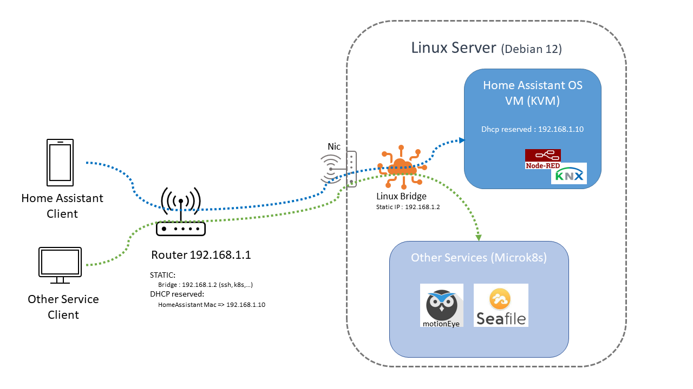
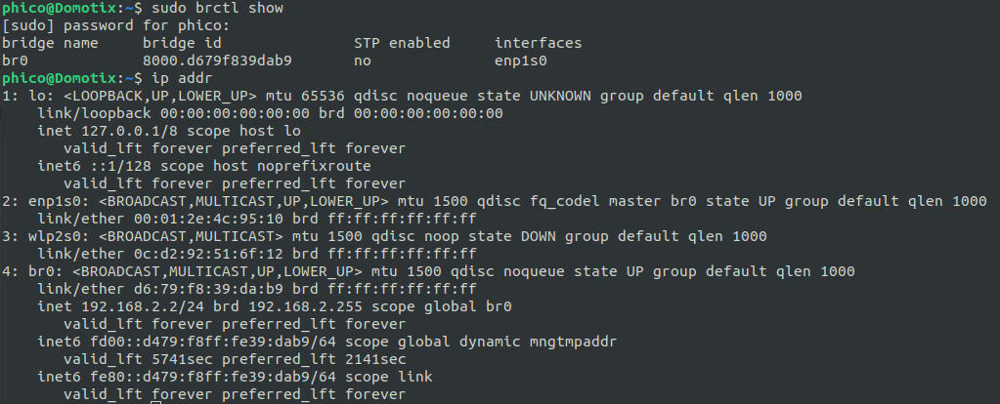

# Linux Bridge + Home Assistant OS VM

This README outlines the steps to set up a Linux Bridge on a Linux server (i.e. Debian 12) and install Home Assistant OS in a KVM virtual machine.

## Infrastructure Schema




## Prerequisites : Install KVM and Required Packages (on Debian 12)

Before setting up your Linux bridge and Home Assistant OS, ensure that KVM and the necessary networking tools are installed on your Linux server. Run the following command to install them:

```bash
sudo apt update
sudo apt install qemu-kvm libvirt-daemon-system libvirt-clients bridge-utils
```

## Step 1: Create a Linux Bridge Configuration

Get access to a Linux Server with KVM (i.e. Debian 12)

Run `ip link show` to find your primary network interface, which may be `eth0`, `enspXsX`, or ...

1. Open `/etc/network/interfaces.d/br0.cfg` in your file editor.
2. Insert the following configuration, replacing `eth0` with your primary network interface if different, and using an address in your router's network (i.e. 192.168.1.2).  :

    <pre><code>
    auto br0
    iface br0 inet static
        address <b>192.168.1.2</b>
        netmask 255.255.255.0
        gateway <b>192.168.1.1</b>
        dns-nameservers 8.8.8.8 8.8.4.4
        bridge_ports <b>eth0</b>
        bridge_stp on
        bridge_fd 0
        bridge_maxwait 0
   </code></pre>
    We use a static address for the bridge because it is used for NAT and other services (ssh,K8s,...)

## Step 2: Adjust Primary Network Interface Configuration

1. Open `/etc/network/interfaces` in your file editor.
2. Comment out or remove any existing configuration for `eth0` and replace with:

   <pre><code>
    # The primary network interface
    allow-hotplug <b>eth0</b>
    iface <b>eth0</b> inet <b>manual</b>
    iface <b>eth0</b> inet6 auto
   </code></pre>

## Step 3: Apply Network Changes

Restart networking with `sudo systemctl restart networking` or reboot with `sudo reboot`.

## Verify Bridge Setup

Check the bridge is correctly setup with `ip addr` or  `sudo brctl show`.



## Install Home Assistant OS in KVM

1. Download the Home Assistant OS image in `qcow2.xz` format from the [official releases page](https://github.com/home-assistant/operating-system/releases/).
2. Decompress the image with the following command:
    ```bash
    unxz haos_ova-11.5.qcow2.xz
    ```
3. Create the VM with:

    ```
    cd /var/lib/libvirt/images/

    virt-install --import --name haos --description "Home Assistant OS" --memory 2048 --vcpus 2 --cpu host --disk path=/path/to/haos_ova-11.5.qcow2,format=qcow2,bus=virtio --network bridge=br0,model=virtio --os-variant=generic --graphics none  --boot uefi

    ```

Replace `/path/to/haos_ova-11.5.qcow2` with the actual path to your `.qcow2` file.

## Verify VM Installation

Check if the VM is installed and running with `virsh list --all`.

## Access Home Assistant

Access Home Assistant in a web browser at `http://192.168.1.10:8123`.

## Setting VM to Autostart on Host Boot

To ensure your Home Assistant OS virtual machine automatically starts when your host system boots, follow these steps:

1. Use `virsh` to list all available virtual machines to find the exact name of your Home Assistant OS VM:
    ```
    sudo virsh list --all
    ```
2. To set your VM to autostart, replace `VM_NAME` with the name of your VM and execute:
    ```
    sudo virsh autostart haos
    ```
 

3. If you ever need to disable the autostart feature for this VM, you can do so by running:
    ```
    sudo virsh autostart haos --disable
    ```

Ensure the `libvirtd` service is enabled to start at boot time:
```
sudo systemctl enable libvirtd
```

## Credits
- Official [installation page] (where the bridge configuration is missing) (https://www.home-assistant.io/installation/alternative).
- Home Assistant community guide: [Install Home Assistant OS with KVM on Ubuntu (Headless, CLI only)](https://community.home-assistant.io/t/install-home-assistant-os-with-kvm-on-ubuntu-headless-cli-only/254941). 

